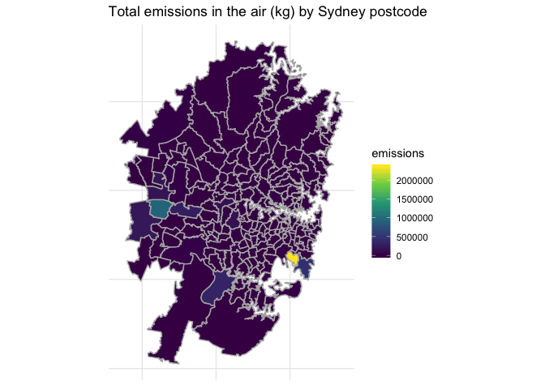
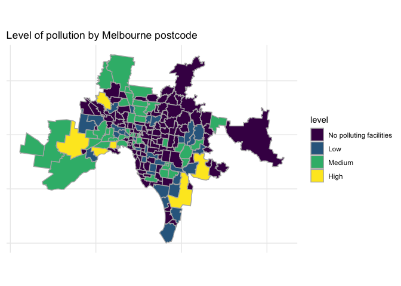

Pollution in Australia by Postcode
================
Neil Saunders
compiled 2018-11-28 22:28:32

-   [Introduction](#introduction)
    -   [Getting the pollution data](#getting-the-pollution-data)
    -   [Getting a shapefile of postcodes](#getting-a-shapefile-of-postcodes)
    -   [Joining the spatial and pollution data](#joining-the-spatial-and-pollution-data)
    -   [Metro area postcodes](#metro-area-postcodes)
-   [The maps](#the-maps)
    -   [Total emissions in the air (kg) - Sydney](#total-emissions-in-the-air-kg---sydney)
    -   [Level of pollution - Melbourne](#level-of-pollution---melbourne)
    -   [Number of polluting facilities - Brisbane](#number-of-polluting-facilities---brisbane)

Introduction
============

In this document we extract the data from the ABC News article [Australia's pollution mapped by postcode reveals nation's 'dirty truth'](https://www.abc.net.au/news/2018-11-16/australian-pollution-mapped-by-postcodes/10478620) and visualise it on maps.

Getting the pollution data
--------------------------

Very easy using `rvest`. It even converts numeric strings with commas to numeric values.

We make a few changes:

-   rename the multi-word column headers
-   add a new column with zero-padded postcode, to join later
-   convert the "Level" description to a correctly-ordered factor

``` r
auspollution <- read_html("https://www.abc.net.au/news/2018-11-16/australian-pollution-mapped-by-postcodes/10478620") %>% 
  html_node("table") %>% 
  html_table() %>% 
  rename(facilities = `Number of polluting facilities`,
         emissions = `Total emissions in the air (kg)`,
         level = `Level of pollution`) %>% 
  mutate(POA_CODE16 = sprintf("%04d", Postcode),
         level = factor(level, levels = c("No polluting facilities", "Low", "Medium", "High")))

auspollution %>% 
  head(10) %>% 
  pander(justify = c("right", "right", "right", "left", "right"))
```

<table>
<colgroup>
<col width="14%" />
<col width="17%" />
<col width="16%" />
<col width="35%" />
<col width="16%" />
</colgroup>
<thead>
<tr class="header">
<th align="right">Postcode</th>
<th align="right">facilities</th>
<th align="right">emissions</th>
<th align="left">level</th>
<th align="right">POA_CODE16</th>
</tr>
</thead>
<tbody>
<tr class="odd">
<td align="right">800</td>
<td align="right">5</td>
<td align="right">1070737</td>
<td align="left">High</td>
<td align="right">0800</td>
</tr>
<tr class="even">
<td align="right">810</td>
<td align="right">0</td>
<td align="right">0</td>
<td align="left">No polluting facilities</td>
<td align="right">0810</td>
</tr>
<tr class="odd">
<td align="right">812</td>
<td align="right">2</td>
<td align="right">42771</td>
<td align="left">Medium</td>
<td align="right">0812</td>
</tr>
<tr class="even">
<td align="right">815</td>
<td align="right">0</td>
<td align="right">0</td>
<td align="left">No polluting facilities</td>
<td align="right">0815</td>
</tr>
<tr class="odd">
<td align="right">820</td>
<td align="right">0</td>
<td align="right">0</td>
<td align="left">No polluting facilities</td>
<td align="right">0820</td>
</tr>
<tr class="even">
<td align="right">822</td>
<td align="right">22</td>
<td align="right">15432012</td>
<td align="left">High</td>
<td align="right">0822</td>
</tr>
<tr class="odd">
<td align="right">828</td>
<td align="right">0</td>
<td align="right">0</td>
<td align="left">No polluting facilities</td>
<td align="right">0828</td>
</tr>
<tr class="even">
<td align="right">829</td>
<td align="right">0</td>
<td align="right">0</td>
<td align="left">No polluting facilities</td>
<td align="right">0829</td>
</tr>
<tr class="odd">
<td align="right">830</td>
<td align="right">0</td>
<td align="right">0</td>
<td align="left">No polluting facilities</td>
<td align="right">0830</td>
</tr>
<tr class="even">
<td align="right">832</td>
<td align="right">0</td>
<td align="right">0</td>
<td align="left">No polluting facilities</td>
<td align="right">0832</td>
</tr>
</tbody>
</table>

Getting a shapefile of postcodes
--------------------------------

You can download the ZIP file *Postal Areas ASGS Ed 2016 Digital Boundaries in ESRI Shapefile Format* from [this ABS page](http://www.abs.gov.au/AUSSTATS/abs@.nsf/DetailsPage/1270.0.55.003July%202016?OpenDocument), unzip and retain just the `.shp` file.

Then read it in:

``` r
# seems to need hard-coded full path :(
auspost <- readOGR("../../data/", "POA_2016_AUST")
```

    ## OGR data source with driver: ESRI Shapefile 
    ## Source: "/Users/neilsaunders/Dropbox/projects/github_projects/health/auspollution/data", layer: "POA_2016_AUST"
    ## with 2670 features
    ## It has 3 fields

Joining the spatial and pollution data
--------------------------------------

We can convert the shapefile data to a data frame using `fortify`, then join the `id` column with the `POA_CODE16` column created previously:

``` r
auspost_f <- fortify(auspost, region = "POA_CODE16") %>% 
  left_join(auspollution, by = c("id" = "POA_CODE16"))
```

Metro area postcodes
--------------------

We don't want to plot the entire country. [This handy PDF](http://www.impactlists.com.au/ImpactLists/media/list-tools/Useful-Postcode-Ranges.pdf) includes postcode ranges for Australian cities. As examples we'll use Sydney, Melbourne and Brisbane.

``` r
sydney <- as.character(c(1000:2249, 2760:2770))
melbourne <- as.character(c(3000:3207, 8000:8499))
brisbane <- as.character(c(4000:4207, 9000:9499))
```

The maps
========

Total emissions in the air (kg) - Sydney
----------------------------------------

The range of values is such that most postcodes have low values that are difficult to distinguish, even with the viridis colour scale.

The Botany area stands out.

``` r
auspost_f %>% 
  filter(id %in% sydney) %>% 
  ggplot(aes(long, lat, group = group)) +
    geom_polygon(aes(fill = emissions), color = "grey70") +
    coord_map() +
    scale_fill_viridis_c() +
    theme(axis.title = element_blank(),
          axis.text = element_blank()) +
    labs(title = "Total emissions in the air (kg) by Sydney postcode")
```



Level of pollution - Melbourne
------------------------------

Using the discrete values for pollution level results in arguably a more interesting map.

``` r
auspost_f %>% 
  filter(id %in% melbourne) %>% 
  ggplot(aes(long, lat, group = group)) +
    geom_polygon(aes(fill = level), color = "grey70") +
    coord_map() +
    scale_fill_viridis_d() +
    theme(axis.title = element_blank(),
          axis.text = element_blank()) +
    labs(title = "Level of pollution by Melbourne postcode")
```



Number of polluting facilities - Brisbane
-----------------------------------------

The number of facilities provides a better continuous range than emissions. We see most facilities where the river meets Moreton Bay (including some of the islands), and south of the city.

``` r
auspost_f %>% 
  filter(id %in% brisbane) %>% 
  ggplot(aes(long, lat, group = group)) +
    geom_polygon(aes(fill = facilities), color = "grey70") +
    coord_map() +
    scale_fill_viridis_c() +
    theme(axis.title = element_blank(),
          axis.text = element_blank()) +
    labs(title = "Number of polluting facilities by Brisbane postcode")
```


