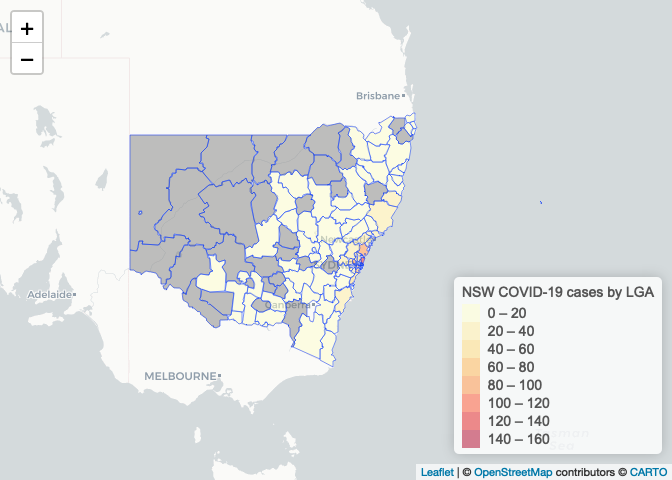

Mapping NSW COVID-19 cases
================
Neil Saunders
compiled 2020-04-02 17:30:10

# Summary

# Code

``` r
# covid data
nsw_covid <- read_csv("https://data.nsw.gov.au/data/datastore/dump/21304414-1ff1-4243-a5d2-f52778048b29?bom=True")

# summary by LGA
lga_count <- nsw_covid %>% 
  count(lga_code19) %>% 
  mutate(LGA_CODE19 = as.character(lga_code19)) %>% 
  na.omit()

# LGA shapefile
lga <- readOGR("../data/1270055003_lga_2019_aust_shp/LGA_2019_AUST.shp")
```

    ## OGR data source with driver: ESRI Shapefile 
    ## Source: "/Users/neilsaunders/Dropbox/projects/github_projects/health/covid19/nsw_covid/data/1270055003_lga_2019_aust_shp/LGA_2019_AUST.shp", layer: "LGA_2019_AUST"
    ## with 562 features
    ## It has 5 fields

``` r
# NSW shapefile
nsw <- subset(lga, STE_CODE16 == 1)

# join data
nsw@data <- nsw@data %>% 
  mutate(LGA_CODE19 = as.character(LGA_CODE19)) %>% 
  left_join(lga_count) %>% 
  mutate(LGA_CODE19 = factor(LGA_CODE19))

# map
pal <- colorBin(
  palette = "YlOrRd",
  domain = lga_count$n,
  n = 8
)

nsw_map <- leaflet() %>% 
  addProviderTiles(providers$CartoDB.Positron) %>% 
  addPolygons(data = nsw,
              weight = 1,
              fillOpacity = 0.5,
              label = ~paste(LGA_NAME19, "=", n),
              fillColor = ~colorBin("YlOrRd", n, bins = 8)(n)) %>% 
  addLegend("bottomright",
            title = "NSW COVID-19 cases by LGA",
            pal = pal,
            values = lga_count$n)
```

# Output

``` r
nsw_map
```

<!-- -->
