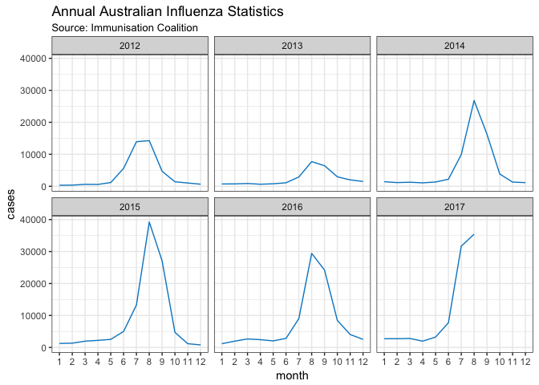
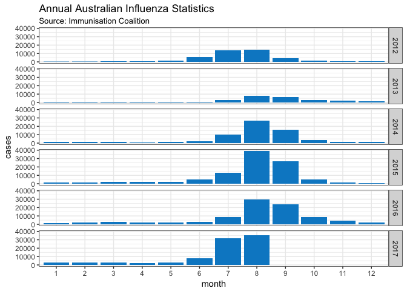

# Visualisation of Australian Influenza Cases
Neil Saunders  
compiled `r Sys.time()`  

# Introduction
More [years as coloured bars](http://www.abc.net.au/news/2017-08-21/flu-influenza-why-2017-has-been-a-particularly-bad-year/8826512). Can we do better?

For future reference, data is updated by the [Immunisation Coalition](http://www.immunisationcoalition.org.au/news-media/2017-statistics/).

# Visualisations
This is clean, but lacks in quick comparison across all years.

<!-- -->

This allows "vertical comparison" by month, but is a little "noisy on the eyes".

<!-- -->
