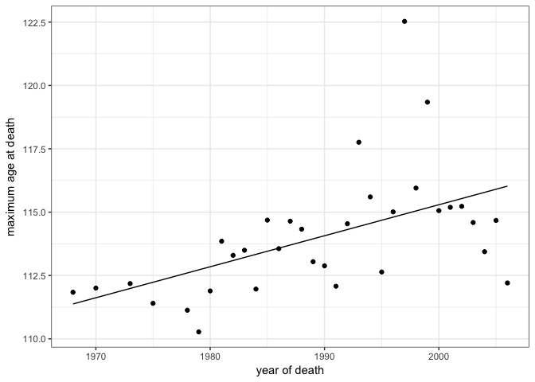
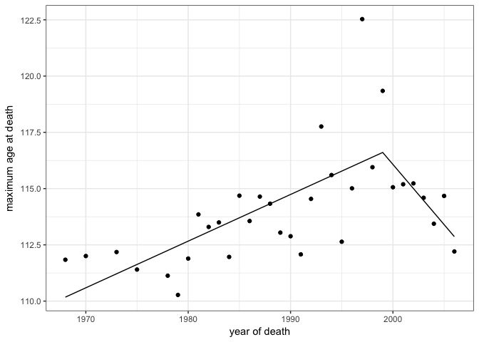
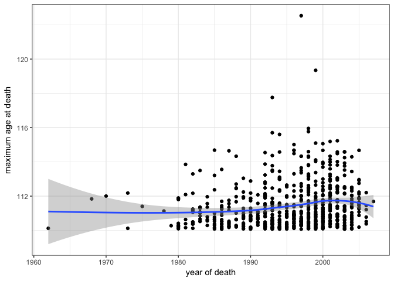

# An Analysis Of: "Evidence for a limit to human lifespan"
Neil Saunders  
14/12/2016  


## Introduction
This is a quick assessment of the data from [Evidence for a limit to human lifespan](http://www.nature.com/nature/journal/v538/n7624/full/nature19793.html). It has been discussed previously in the NRC articles [Nature article is wrong about 115 year limit on human lifespan](https://www.nrc.nl/nieuws/2016/10/07/human-lifespan-limited-to-115-years-a1525476) and [Statistical problems, but not enough to warrant a rejection](https://www.nrc.nl/nieuws/2016/12/09/statistical-problems-but-not-enough-to-warrant-a-rejection-a1535908).

This document indicates how to retrieve the data used in the _Nature_ paper for your own analysis. However, you're probably wasting your time since Berens & Wallis already did a great job. It is [described here](http://www.askaswiss.com/2016/11/is-there-really-evidence-for-limit-to-human-lifespan.html) and [wonderfully-documented here](https://github.com/philippberens/lifespan).

## Getting the data
### IDL Data
You can easily get data from the [International Database on Longevity](http://www.supercentenarians.org/Home/Expand_IDL) by creating an account, logging in and downloading their CSV files for each country. You could also automate the process using _e.g. rvest_ if desired. 

```r
# create an account at the International Database on Longevity then login at
# http://www.supercentenarians.org/User/Login and download all of their CSV
# files
files <- list.files("~/Dropbox/projects/github_projects/health/longevity/data/", 
    full.names = TRUE, pattern = "*.csv")
l1 <- lapply(files, function(x) read.csv(x, sep = ";", header = TRUE, stringsAsFactors = FALSE))
idl <- do.call(rbind, l1)

# format the dates this returns NA for those with year only (e.g. USA)
idl$dob <- dmy(idl$Date.of.birth)
idl$dod <- dmy(idl$Date.of.death)

# get years from dates
get_year <- function(d) {
    y <- NA
    if (nchar(d) == 4) {
        y <- as.numeric(d)
    } else if (nchar(d) == 10) {
        y <- as.numeric(substr(d, 7, 10))
    }
    return(y)
}

# add year of birth, death columns
idl$yob <- sapply(idl$Date.of.birth, get_year)
idl$yod <- sapply(idl$Date.of.death, get_year)
```

### GRG Data
Data from the [Gerentology Research Group](http://www.grg.org/) is a little harder to process, since we have to web-scrape some cleverly-hidden URLs.

```r
format_date <- function(d) {
    asdate <- NA
    d.split <- strsplit(d, " ")
    if (length(d.split[[1]]) == 3) {
        mon <- substr(d.split[[1]][1], 1, 3)
        day <- gsub(",", "", d.split[[1]][2])
        yr <- d.split[[1]][3]
        asdate <- paste(yr, mon, day, sep = "-")
    }
    return(asdate)
}

grg_url <- "http://www.grg.org/Adams/A_files/sheet001.htm"
grg <- readHTMLTable(grg_url, stringsAsFactors = FALSE)
grg <- grg[[1]][12:nrow(grg[[1]]), ]
colnames(grg) <- grg[1, ]
grg <- grg[2:(nrow(grg) - 10), ]

# format the dates
grg$dob <- sapply(grg$Born, format_date)
grg$dob <- ymd(grg$dob)
grg$dod <- sapply(grg$Died, format_date)
grg$dod <- ymd(grg$dod)
```

## Processing the data
IDL n = 668. The _Nature_ paper states that n = 534. We get there by using data only where country of death was France, Great Britain, Japan or the USA. We get the data used for figure 2a of the paper by aggregating the data to give us the maximum age at death (in days) for each year. This is the variable maximum reported age at death and n = 33.


```r
idl4 <- idl[idl$Country.of.death %in% c("FRA", "GBR", "JPN", "USA"), ]
idl4.max <- aggregate(Age.days. ~ yod, idl4, max)
```


## Modelling
### Linear regression
The simplest linear regression.

```r
idl4.lm <- lm(Age.days. ~ yod, idl4.max)
glance(idl4.lm)
```

```
##   r.squared adj.r.squared    sigma statistic     p.value df    logLik
## 1 0.2777109     0.2544113 769.2955   11.9191 0.001627574  2 -265.0941
##        AIC      BIC deviance df.residual
## 1 536.1881 540.6777 18346280          31
```

```r
ggplot(idl4.lm) + geom_line(aes(yod, .fitted/365)) + theme_bw() + geom_point(aes(yod, 
    Age.days./365)) + labs(x = "year of death", y = "maximum age at death")
```

<!-- -->

### Linear regression with breakpoints
We use the _segmented_ package to model linear regression with breakpoints. 

```r
idl4.sm <- segmented(idl4.lm, ~yod)
glance(idl4.sm)
```

```
##   r.squared adj.r.squared   sigma statistic      p.value df    logLik
## 1 0.4789047     0.4249983 675.582  8.884002 0.0002477871  4 -259.7069
##        AIC      BIC deviance df.residual
## 1 529.4139 536.8964 13235920          29
```

```r
ggplot(idl4.sm) + geom_line(aes(yod, .fitted/365)) + theme_bw() + geom_point(aes(yod, 
    Age.days./365)) + labs(x = "year of death", y = "maximum age at death")
```

<!-- -->

For comparison, here is the complete n = 668 dataset with the default LOESS smoothing fitted by _geom\_smooth_. Note that the confidence interval around the later values allows for a slight upward trend.


```r
ggplot(idl) + theme_bw() + geom_point(aes(yod, Age.days./365)) + labs(x = "year of death", 
    y = "maximum age at death") + geom_smooth(aes(yod, Age.days./365))
```

<!-- -->

## Conclusions
* It is possible to model the IDL data using piecewise regression
* However, in contrast to the paper, the breakpoint is early 1999 (not 1995), standard error ~ 2.2 years
* Agree with previous analysis that the segmented model is not superior to a basic linear model

