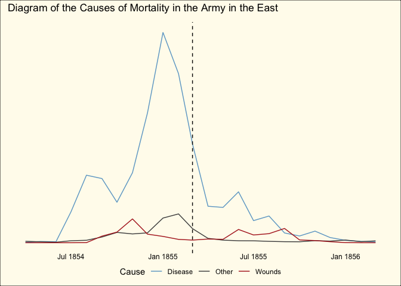

Nightingale’s Rose Charts
================
Neil Saunders
compiled 2021-03-16 20:40:38

-   [Summary](#summary)
-   [The data](#the-data)
-   [Reshaping](#reshaping)
-   [Charts](#charts)
    -   [The “rose chart”](#the-rose-chart)
    -   [Column chart](#column-chart)
    -   [Line chart](#line-chart)
-   [Conclusions](#conclusions)

# Summary

A brief exploration of Florence Nightingale’s Crimean War dataset,
inspired by “Florence Nightingale: Data Viz Pioneer”, an episode of
*Cautionary Tales* [premiered by 99%
Invisible](https://99percentinvisible.org/episode/florence-nightingale-data-viz-pioneer/).

# The data

We can get the dataset `Nightingale` from the R package
[histData](https://cran.r-project.org/web/packages/HistData/index.html).

It’s quite small (24 rows) and looks like this:

<table class="table table-striped table-condensed" style="font-size: 10px; margin-left: auto; margin-right: auto;">
<thead>
<tr>
<th style="text-align:left;">
Date
</th>
<th style="text-align:left;">
Month
</th>
<th style="text-align:right;">
Year
</th>
<th style="text-align:right;">
Army
</th>
<th style="text-align:right;">
Disease
</th>
<th style="text-align:right;">
Wounds
</th>
<th style="text-align:right;">
Other
</th>
<th style="text-align:right;">
Disease.rate
</th>
<th style="text-align:right;">
Wounds.rate
</th>
<th style="text-align:right;">
Other.rate
</th>
</tr>
</thead>
<tbody>
<tr>
<td style="text-align:left;">
1854-04-01
</td>
<td style="text-align:left;">
Apr
</td>
<td style="text-align:right;">
1854
</td>
<td style="text-align:right;">
8571
</td>
<td style="text-align:right;">
1
</td>
<td style="text-align:right;">
0
</td>
<td style="text-align:right;">
5
</td>
<td style="text-align:right;">
1.4
</td>
<td style="text-align:right;">
0.0
</td>
<td style="text-align:right;">
7.0
</td>
</tr>
<tr>
<td style="text-align:left;">
1854-05-01
</td>
<td style="text-align:left;">
May
</td>
<td style="text-align:right;">
1854
</td>
<td style="text-align:right;">
23333
</td>
<td style="text-align:right;">
12
</td>
<td style="text-align:right;">
0
</td>
<td style="text-align:right;">
9
</td>
<td style="text-align:right;">
6.2
</td>
<td style="text-align:right;">
0.0
</td>
<td style="text-align:right;">
4.6
</td>
</tr>
<tr>
<td style="text-align:left;">
1854-06-01
</td>
<td style="text-align:left;">
Jun
</td>
<td style="text-align:right;">
1854
</td>
<td style="text-align:right;">
28333
</td>
<td style="text-align:right;">
11
</td>
<td style="text-align:right;">
0
</td>
<td style="text-align:right;">
6
</td>
<td style="text-align:right;">
4.7
</td>
<td style="text-align:right;">
0.0
</td>
<td style="text-align:right;">
2.5
</td>
</tr>
<tr>
<td style="text-align:left;">
1854-07-01
</td>
<td style="text-align:left;">
Jul
</td>
<td style="text-align:right;">
1854
</td>
<td style="text-align:right;">
28722
</td>
<td style="text-align:right;">
359
</td>
<td style="text-align:right;">
0
</td>
<td style="text-align:right;">
23
</td>
<td style="text-align:right;">
150.0
</td>
<td style="text-align:right;">
0.0
</td>
<td style="text-align:right;">
9.6
</td>
</tr>
<tr>
<td style="text-align:left;">
1854-08-01
</td>
<td style="text-align:left;">
Aug
</td>
<td style="text-align:right;">
1854
</td>
<td style="text-align:right;">
30246
</td>
<td style="text-align:right;">
828
</td>
<td style="text-align:right;">
1
</td>
<td style="text-align:right;">
30
</td>
<td style="text-align:right;">
328.5
</td>
<td style="text-align:right;">
0.4
</td>
<td style="text-align:right;">
11.9
</td>
</tr>
<tr>
<td style="text-align:left;">
1854-09-01
</td>
<td style="text-align:left;">
Sep
</td>
<td style="text-align:right;">
1854
</td>
<td style="text-align:right;">
30290
</td>
<td style="text-align:right;">
788
</td>
<td style="text-align:right;">
81
</td>
<td style="text-align:right;">
70
</td>
<td style="text-align:right;">
312.2
</td>
<td style="text-align:right;">
32.1
</td>
<td style="text-align:right;">
27.7
</td>
</tr>
<tr>
<td style="text-align:left;">
1854-10-01
</td>
<td style="text-align:left;">
Oct
</td>
<td style="text-align:right;">
1854
</td>
<td style="text-align:right;">
30643
</td>
<td style="text-align:right;">
503
</td>
<td style="text-align:right;">
132
</td>
<td style="text-align:right;">
128
</td>
<td style="text-align:right;">
197.0
</td>
<td style="text-align:right;">
51.7
</td>
<td style="text-align:right;">
50.1
</td>
</tr>
<tr>
<td style="text-align:left;">
1854-11-01
</td>
<td style="text-align:left;">
Nov
</td>
<td style="text-align:right;">
1854
</td>
<td style="text-align:right;">
29736
</td>
<td style="text-align:right;">
844
</td>
<td style="text-align:right;">
287
</td>
<td style="text-align:right;">
106
</td>
<td style="text-align:right;">
340.6
</td>
<td style="text-align:right;">
115.8
</td>
<td style="text-align:right;">
42.8
</td>
</tr>
<tr>
<td style="text-align:left;">
1854-12-01
</td>
<td style="text-align:left;">
Dec
</td>
<td style="text-align:right;">
1854
</td>
<td style="text-align:right;">
32779
</td>
<td style="text-align:right;">
1725
</td>
<td style="text-align:right;">
114
</td>
<td style="text-align:right;">
131
</td>
<td style="text-align:right;">
631.5
</td>
<td style="text-align:right;">
41.7
</td>
<td style="text-align:right;">
48.0
</td>
</tr>
<tr>
<td style="text-align:left;">
1855-01-01
</td>
<td style="text-align:left;">
Jan
</td>
<td style="text-align:right;">
1855
</td>
<td style="text-align:right;">
32393
</td>
<td style="text-align:right;">
2761
</td>
<td style="text-align:right;">
83
</td>
<td style="text-align:right;">
324
</td>
<td style="text-align:right;">
1022.8
</td>
<td style="text-align:right;">
30.7
</td>
<td style="text-align:right;">
120.0
</td>
</tr>
<tr>
<td style="text-align:left;">
1855-02-01
</td>
<td style="text-align:left;">
Feb
</td>
<td style="text-align:right;">
1855
</td>
<td style="text-align:right;">
30919
</td>
<td style="text-align:right;">
2120
</td>
<td style="text-align:right;">
42
</td>
<td style="text-align:right;">
361
</td>
<td style="text-align:right;">
822.8
</td>
<td style="text-align:right;">
16.3
</td>
<td style="text-align:right;">
140.1
</td>
</tr>
<tr>
<td style="text-align:left;">
1855-03-01
</td>
<td style="text-align:left;">
Mar
</td>
<td style="text-align:right;">
1855
</td>
<td style="text-align:right;">
30107
</td>
<td style="text-align:right;">
1205
</td>
<td style="text-align:right;">
32
</td>
<td style="text-align:right;">
172
</td>
<td style="text-align:right;">
480.3
</td>
<td style="text-align:right;">
12.8
</td>
<td style="text-align:right;">
68.6
</td>
</tr>
<tr>
<td style="text-align:left;">
1855-04-01
</td>
<td style="text-align:left;">
Apr
</td>
<td style="text-align:right;">
1855
</td>
<td style="text-align:right;">
32252
</td>
<td style="text-align:right;">
477
</td>
<td style="text-align:right;">
48
</td>
<td style="text-align:right;">
57
</td>
<td style="text-align:right;">
177.5
</td>
<td style="text-align:right;">
17.9
</td>
<td style="text-align:right;">
21.2
</td>
</tr>
<tr>
<td style="text-align:left;">
1855-05-01
</td>
<td style="text-align:left;">
May
</td>
<td style="text-align:right;">
1855
</td>
<td style="text-align:right;">
35473
</td>
<td style="text-align:right;">
508
</td>
<td style="text-align:right;">
49
</td>
<td style="text-align:right;">
37
</td>
<td style="text-align:right;">
171.8
</td>
<td style="text-align:right;">
16.6
</td>
<td style="text-align:right;">
12.5
</td>
</tr>
<tr>
<td style="text-align:left;">
1855-06-01
</td>
<td style="text-align:left;">
Jun
</td>
<td style="text-align:right;">
1855
</td>
<td style="text-align:right;">
38863
</td>
<td style="text-align:right;">
802
</td>
<td style="text-align:right;">
209
</td>
<td style="text-align:right;">
31
</td>
<td style="text-align:right;">
247.6
</td>
<td style="text-align:right;">
64.5
</td>
<td style="text-align:right;">
9.6
</td>
</tr>
<tr>
<td style="text-align:left;">
1855-07-01
</td>
<td style="text-align:left;">
Jul
</td>
<td style="text-align:right;">
1855
</td>
<td style="text-align:right;">
42647
</td>
<td style="text-align:right;">
382
</td>
<td style="text-align:right;">
134
</td>
<td style="text-align:right;">
33
</td>
<td style="text-align:right;">
107.5
</td>
<td style="text-align:right;">
37.7
</td>
<td style="text-align:right;">
9.3
</td>
</tr>
<tr>
<td style="text-align:left;">
1855-08-01
</td>
<td style="text-align:left;">
Aug
</td>
<td style="text-align:right;">
1855
</td>
<td style="text-align:right;">
44614
</td>
<td style="text-align:right;">
483
</td>
<td style="text-align:right;">
164
</td>
<td style="text-align:right;">
25
</td>
<td style="text-align:right;">
129.9
</td>
<td style="text-align:right;">
44.1
</td>
<td style="text-align:right;">
6.7
</td>
</tr>
<tr>
<td style="text-align:left;">
1855-09-01
</td>
<td style="text-align:left;">
Sep
</td>
<td style="text-align:right;">
1855
</td>
<td style="text-align:right;">
47751
</td>
<td style="text-align:right;">
189
</td>
<td style="text-align:right;">
276
</td>
<td style="text-align:right;">
20
</td>
<td style="text-align:right;">
47.5
</td>
<td style="text-align:right;">
69.4
</td>
<td style="text-align:right;">
5.0
</td>
</tr>
<tr>
<td style="text-align:left;">
1855-10-01
</td>
<td style="text-align:left;">
Oct
</td>
<td style="text-align:right;">
1855
</td>
<td style="text-align:right;">
46852
</td>
<td style="text-align:right;">
128
</td>
<td style="text-align:right;">
53
</td>
<td style="text-align:right;">
18
</td>
<td style="text-align:right;">
32.8
</td>
<td style="text-align:right;">
13.6
</td>
<td style="text-align:right;">
4.6
</td>
</tr>
<tr>
<td style="text-align:left;">
1855-11-01
</td>
<td style="text-align:left;">
Nov
</td>
<td style="text-align:right;">
1855
</td>
<td style="text-align:right;">
37853
</td>
<td style="text-align:right;">
178
</td>
<td style="text-align:right;">
33
</td>
<td style="text-align:right;">
32
</td>
<td style="text-align:right;">
56.4
</td>
<td style="text-align:right;">
10.5
</td>
<td style="text-align:right;">
10.1
</td>
</tr>
<tr>
<td style="text-align:left;">
1855-12-01
</td>
<td style="text-align:left;">
Dec
</td>
<td style="text-align:right;">
1855
</td>
<td style="text-align:right;">
43217
</td>
<td style="text-align:right;">
91
</td>
<td style="text-align:right;">
18
</td>
<td style="text-align:right;">
28
</td>
<td style="text-align:right;">
25.3
</td>
<td style="text-align:right;">
5.0
</td>
<td style="text-align:right;">
7.8
</td>
</tr>
<tr>
<td style="text-align:left;">
1856-01-01
</td>
<td style="text-align:left;">
Jan
</td>
<td style="text-align:right;">
1856
</td>
<td style="text-align:right;">
44212
</td>
<td style="text-align:right;">
42
</td>
<td style="text-align:right;">
2
</td>
<td style="text-align:right;">
48
</td>
<td style="text-align:right;">
11.4
</td>
<td style="text-align:right;">
0.5
</td>
<td style="text-align:right;">
13.0
</td>
</tr>
<tr>
<td style="text-align:left;">
1856-02-01
</td>
<td style="text-align:left;">
Feb
</td>
<td style="text-align:right;">
1856
</td>
<td style="text-align:right;">
43485
</td>
<td style="text-align:right;">
24
</td>
<td style="text-align:right;">
0
</td>
<td style="text-align:right;">
19
</td>
<td style="text-align:right;">
6.6
</td>
<td style="text-align:right;">
0.0
</td>
<td style="text-align:right;">
5.2
</td>
</tr>
<tr>
<td style="text-align:left;">
1856-03-01
</td>
<td style="text-align:left;">
Mar
</td>
<td style="text-align:right;">
1856
</td>
<td style="text-align:right;">
46140
</td>
<td style="text-align:right;">
15
</td>
<td style="text-align:right;">
0
</td>
<td style="text-align:right;">
35
</td>
<td style="text-align:right;">
3.9
</td>
<td style="text-align:right;">
0.0
</td>
<td style="text-align:right;">
9.1
</td>
</tr>
</tbody>
</table>

# Reshaping

The dataset is not tidy.

-   each cause has its own column, rather than columns for cause + value
-   columns are a mixture of rates and absolute values

We can select the rate columns and use `pivot_longer` to convert to long
format.

<table class="table table-striped table-condensed" style="font-size: 10px; margin-left: auto; margin-right: auto;">
<thead>
<tr>
<th style="text-align:left;">
Date
</th>
<th style="text-align:left;">
Month
</th>
<th style="text-align:right;">
Year
</th>
<th style="text-align:left;">
Cause
</th>
<th style="text-align:right;">
Rate
</th>
</tr>
</thead>
<tbody>
<tr>
<td style="text-align:left;">
1854-04-01
</td>
<td style="text-align:left;">
Apr
</td>
<td style="text-align:right;">
1854
</td>
<td style="text-align:left;">
Disease
</td>
<td style="text-align:right;">
1.4
</td>
</tr>
<tr>
<td style="text-align:left;">
1854-04-01
</td>
<td style="text-align:left;">
Apr
</td>
<td style="text-align:right;">
1854
</td>
<td style="text-align:left;">
Wounds
</td>
<td style="text-align:right;">
0.0
</td>
</tr>
<tr>
<td style="text-align:left;">
1854-04-01
</td>
<td style="text-align:left;">
Apr
</td>
<td style="text-align:right;">
1854
</td>
<td style="text-align:left;">
Other
</td>
<td style="text-align:right;">
7.0
</td>
</tr>
<tr>
<td style="text-align:left;">
1854-05-01
</td>
<td style="text-align:left;">
May
</td>
<td style="text-align:right;">
1854
</td>
<td style="text-align:left;">
Disease
</td>
<td style="text-align:right;">
6.2
</td>
</tr>
<tr>
<td style="text-align:left;">
1854-05-01
</td>
<td style="text-align:left;">
May
</td>
<td style="text-align:right;">
1854
</td>
<td style="text-align:left;">
Wounds
</td>
<td style="text-align:right;">
0.0
</td>
</tr>
<tr>
<td style="text-align:left;">
1854-05-01
</td>
<td style="text-align:left;">
May
</td>
<td style="text-align:right;">
1854
</td>
<td style="text-align:left;">
Other
</td>
<td style="text-align:right;">
4.6
</td>
</tr>
</tbody>
</table>

# Charts

The help page, `?Nightingale` provides some R code to generate polar
area and line charts but it’s somewhat dated and cumbersome. Let’s give
it the tidyverse treatment.

## The “rose chart”

The “rose chart”, also called (incorrectly) a Coxcomb chart, or polar
area chart, is a bar chart projected onto polar coordinates.

We can generate something very similar to Nightingale’s original chart
like this:

<!-- -->

## Column chart

We can’t simply remove the polar coordinates, as this will place some
months in the wrong position on the basic column chart. So now we use
`Date` on the x-axis.

We can also indicate the period before the arrival of the Sanitary
Commission using grey shading.

<!-- -->

## Line chart

We can also show the data as a line chart.

<!-- -->

# Conclusions

The *Cautionary Tales* podcast episode concludes that deaths from
disease were falling before the arrival of the Sanitary Commission, and
that this is obscured - perhaps deliberately - by the choice of the
polar area chart.

It’s a fair point. However, what we can’t know is what would have
happened through 1855 in the absence of the Sanitary Commission. Is
there a hint of the same “double peak”, with a seasonal cycle, but
smaller? Is that evidence for the effect of sanitation improvement?
