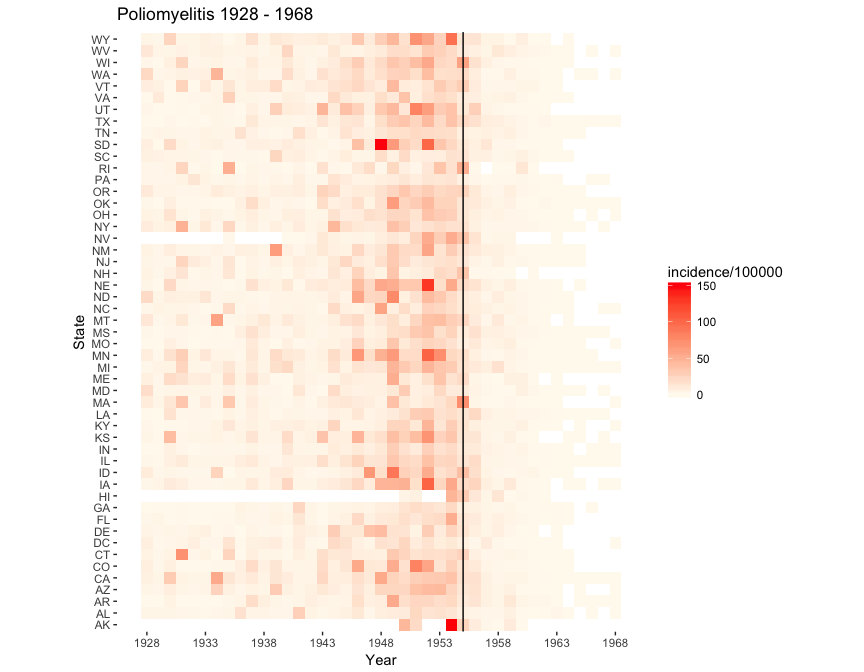
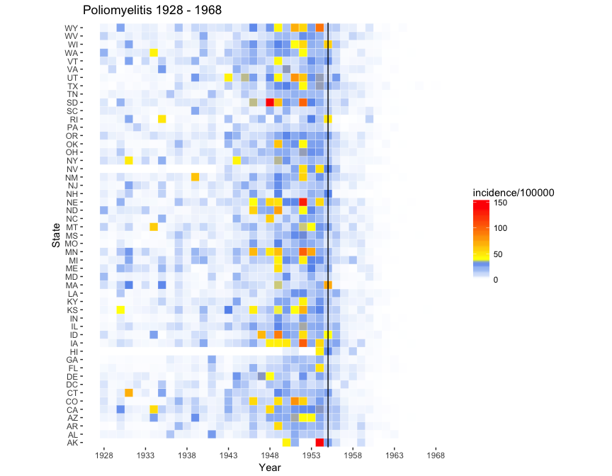

Visualization of Project Tycho data using ggplot2
================
Neil Saunders
2018-03-29 17:46:39

-   [Introduction](#introduction)
-   [Functions](#functions)
    -   [Obtaining and reading the data](#obtaining-and-reading-the-data)
    -   [Normalizing to cases per 100 000 population](#normalizing-to-cases-per-100-000-population)
-   [Visualization](#visualization)
    -   [Using geom\_tile()](#using-geom_tile)
    -   [Using geom\_tile() + a "WSJ-like" colour palette](#using-geom_tile-a-wsj-like-colour-palette)
-   [Summary](#summary)

Introduction
============

This document explores the visualization of public health data obtained from [Project Tycho](https://www.tycho.pitt.edu/). It's inspired by [a blog post](https://biomickwatson.wordpress.com/2015/04/09/recreating-a-famous-visualisation/) from Mick Watson, describing the use of R base graphics to recreate [visualizations of vaccine effectiveness](http://graphics.wsj.com/infectious-diseases-and-vaccines/) published by the Wall Street Journal. In this document, we try to generate something similar using ggplot2. This has also been explored [by Benjamin Moore](https://benjaminlmoore.wordpress.com/2015/04/09/recreating-the-vaccination-heatmaps-in-r/). I also wrote [a blog post](https://nsaunders.wordpress.com/2015/04/15/project-tycho-ggplot2-and-the-shameless-stealing-of-blog-ideas/) on the topic.

Functions
=========

Obtaining and reading the data
------------------------------

Unfortunately Project Tycho data are not directly available from the Web; users must register, login, browse the data and download a CSV file. The procedure is explained in Mick's blog post. We load the required packages, then read the CSV file.

    ## Observations: 1,860
    ## Variables: 3
    ## $ year      <dbl> 1928, 1928, 1928, 1928, 1928, 1928, 1928, 1928, 1928...
    ## $ state     <chr> "AL", "AR", "AZ", "CA", "CO", "CT", "DC", "DE", "FL"...
    ## $ incidence <dbl> 2.39, 0.52, 2.61, 5.04, 7.04, 4.53, 6.92, 3.44, 1.47...

Normalizing to cases per 100 000 population
-------------------------------------------

Originally we had code here to download historical US state population estimates and normalise disease cases. However, Benjamin pointed out in his blog post that Project Tycho Level 1 data are already normalised by population.

Visualization
=============

Using geom\_tile()
------------------

We can get a grid that resembles the WSJ plots using *geom\_tile()*.

Using geom\_tile() + a "WSJ-like" colour palette
------------------------------------------------

As Mick noted in his blog post, the WSJ fiddled with bin sizes and break points to generate more yellow/orange/red for pre-vaccine years. We haven't explored that in this document, so our chart has the same colour scheme but looks a little different.

Summary
=======

-   Not *too much* work for some quite attractive output, thanks to great R packages; Hadley, love your work
-   As ever, the main challenge is getting the raw data into shape

The WSJ plots used the [Highcharts](http://www.highcharts.com/) Javascript plotting library, so it should be possible to create something very similar in R using the [rCharts package](https://github.com/ramnathv/rCharts) or [highcharter](http://jkunst.com/highcharter/) packages.
